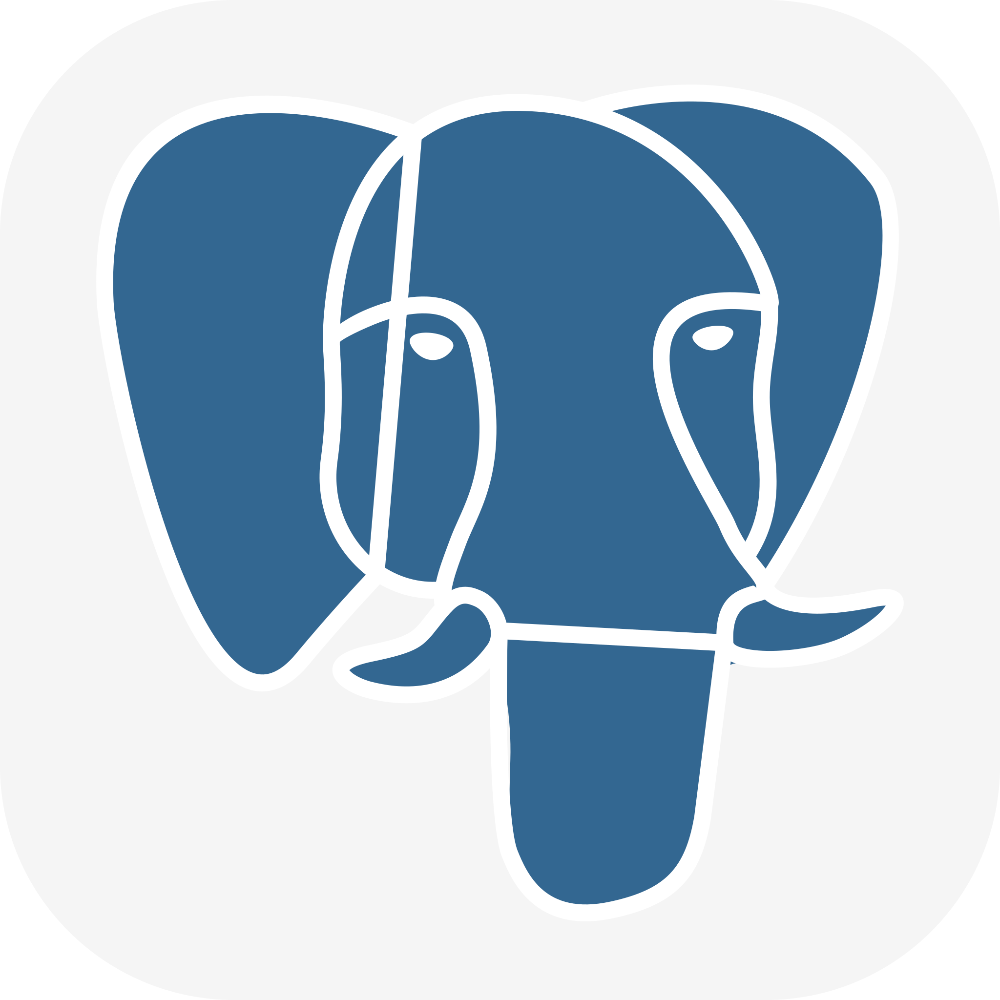

# Hi there! 👋
# I'm Viktoriya and QA Automation engineer 

## About Me:
- 👩‍💻 **Experience**: In testing for more than 4 years, I specialize in testing websites and APIs
- 🕹️ **Manual Testing**: I pay attention to user scenarios and product requirements
- 🤖 **Automation Testing**: I use Java and selenide to solve automation problems
- 🤝 **international cooperation**: I thrive in diverse multinational environments, collaborating effectively with teams of varied backgrounds and perspectives
- 🌱 **Skills development**: I enjoy learning new technologies and tools to improve my professional skills
- 🌍 **Languages**: Russian**, English (A2)

## Languages & Tools I use:

## My Projects
| Year | Repository                                                                       | 
|------|----------------------------------------------------------------------------------|
| 2024 | [Pinterest project UI](https://github.com/viktorinka/pinterest_project_ui) 
      |
| 2024 | [Pinterest project Mobile](https://github.com/viktorinka/pinterest_project_mobile) |
| 2024 | [Petstore project API](https://github.com/viktorinka/petstore_project_api)   |                                                                                |

## My Stats

  
  
  
  

## Contacts for communication
   
  

